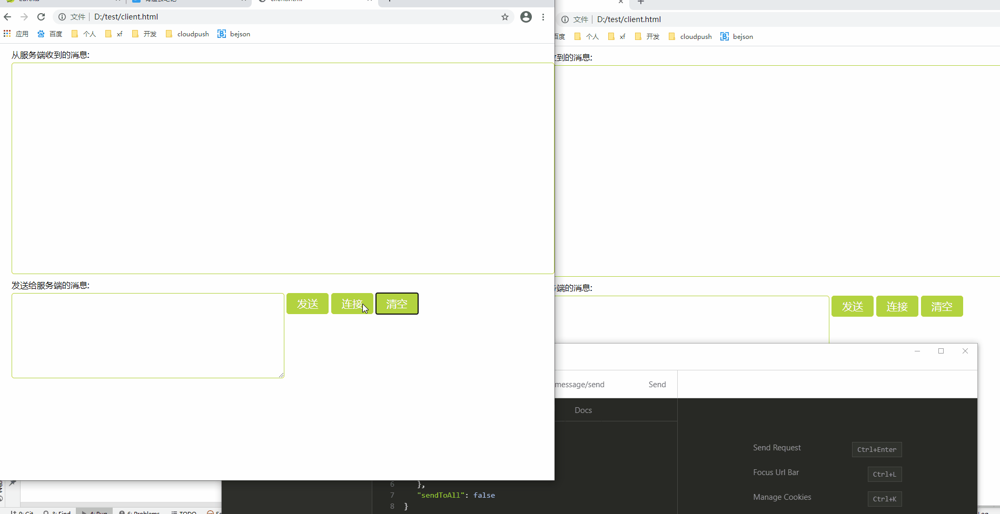
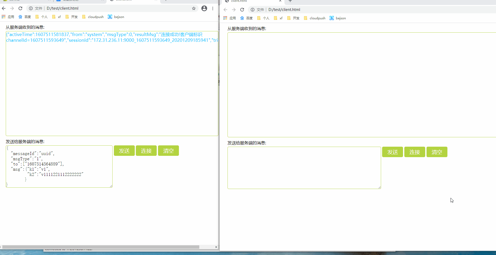

# 项目用到的技术
目前核心的技术栈采用的是SpringBoot2.0.1.RELEASE

## 后端使用的技术
后端的主要架构是基于springboot.

* SpringCloud
* Netty
* Nacos
* Redis
* RocketMQ

# 项目模块说明

| tools  工具包                                | 压缩包 | 项目，或者测试中需要用的到中间件包，直接用docker更方便。。             |
| ------------------------------------------------------------ | --------- | ---------------------------------------------------- |
| cloudpush-api 公共组件部分                                    | jar       | 公共组件，很多地方都有引用         |
| cloudpush-eureka 注册中心                           | web项目  | 为啥有了nacos还要eureka：通过@EventListener额外增加对websocket服务状态的监听，从而动态地将websocket服务中额外启动的netty服务的ip、port维护进redis(用zk来维护这个地址也一样)                      |
| cloudpush-portal 接口服务                  | web项目   | 提供http接口服务                                             |
| cloudpush-task 后台计算服务                  | web项目   | 现仅仅根据各个websocket的连接数计算路由权重存进redis，不是运行系统的必要条件|     
| cloudpush-websocket 推送服务                | web项目  | 由springboot启动的一个netty服务，启动的netty端口提供websocket的握手，消息的收发服务                    |
| cloudpush-gateway 统一网关    | web项目   | 统一入口,便于未来鉴权，现在用作根据redis中的websocket路由权重，生成ws连接的动态路由规则（优先分配给连接数较少的实例）|

# 效果图
## 以http形式触发的推送

## 以websocket形式触发的推送


# 消息解析
### http
```
{
	"to": ["1607080309668","1607071389121"],
	"msg": {
		"key1": "value",
		"key2": "value2"
	},
	"sendToAll": false
}
```
### websocket
```
{"activeTime":1607080644685,"from":"system","messageId":"725cf41a5798474fb31a1258bed2d5d8","msg":{"key1":"value","key2":"value2"},"requestId":"f231012a-b2ed-40b1-841a-45538dc48ee1","sessionId":"172.31.236.11:9000_1607080309668_20201204191140","to":"1607080309668","trigger":1,"msgType":1}  
```

## 客户端收到的websocket消息详解
| 值 |  意义  |
| -- | ---- |
| activeTime | 发生时间 |
| from | 消息来源 |
| messageId | 唯一消息id，用于回执重发保证送达率（暂未实现） |
| requestId | 请求id，以http形式触发的时候会存在，用于写es统计 |     
| sessionId | 会话id，在一次连接中保持一致，用于写es统计 |
| msg | 具体推送的消息内容 |
| to | 推送的目的地（客户端标识） |
| trigger | 消息触发方式（http或者websocket） |
| msgType | //错误代码ERROR(-1,"error"),//连接类型消息CONNECTION(0,"connection"),//发送的业务类型消息BUSSINESS(1,"bussiness"),//发送的业务类型消息的回执BUSSINESS_ACK(2,"bussiness_ack"),//心跳类型HEARTBEAT(3,"heartbeat"),//心跳类型回执HEARTBEAT_ACK(4,"heartbeat_ack");|

